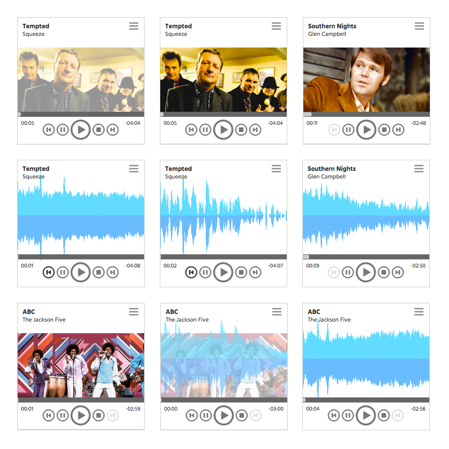

# audiancy

Mini audio player with playlist ability, cover art support,  and waveform visualizations, written in JavaScript with optional PHP backend.  Audiancy does not utilize any third party code.

Not ready for release.  Much left to do.

Written by and Copyright 2016 Greg Raaum.  Use or distribution of this software requires a license.

###Features

- HTML5 and Web Audio API compatible
- Cover art support (optional)
- Internationalization support
- Custom icon font face with CSS styling
- Custom waveform visualizations (optional)
- Customizable colors, sizes
- Progress bar
- Custom controls
- Duration/Elapsed/Remaining time visuals
- Playlists (optional)
- CSS animations and transitions between tracks, on events, and in dropdown
- Platform independent code with no known third party library/framework incompatibilities
- MP3, WAV, OGG audio formats supported
- more

###TODO

- Playlist in dropdown
- Pagination for longer playlists
- Iframe support
- Node optional backend
- Translation to major languages
- Volume controls
- Make draggable
- Remote and cloud playlists
- more

###Screenshots

This is the actual size.

